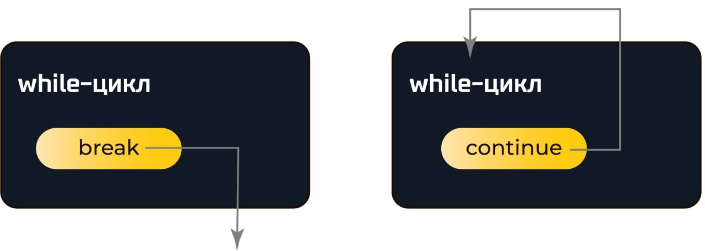

```python
for i in range(10):
    print('Привет')
```


### Задача "Квадрат числа"
На вход программе подается натуральное число `n`. Напишите программу, которая для каждого из чисел от `0` до `n` (включительно) выводит фразу: «Квадрат числа [`число`] равен [`число`]».


```python
range(n) # от 0 до n-1
range(5) # 0,1,2,3,4

range(n, m) # от n до m-1
range(3,6) # 3,4,5

range(n, m, k) #  от n до m-1 с шагом k
range(3,10,2) # 3,5,7,9
```


## Отрицательный шаг:
```python
for i in range(5, 0, -1):
    print(i, end=' ')
print('Взлетаем!!!')
```


## Цикл for
```python
for name in 'uberkek', 'Monolith986', 'Staivon',
  '@Vikusssa', 'KloyJokes', 'TheDiamondX', 'Cвета', 'Матвей':
    print(name, ', ты сделал домашку?', sep='')
```

```python
pupils = ['uberkek', 'Monolith986', 'Staivon',
  '@Vikusssa', 'KloyJokes', 'TheDiamondX', 'Cвета', 'Матвей']
for pupil in pupils:
  print(pupil, ', ты сделал домашку?', sep='')

```


```python
i = 0
while i < 10:
    print('Привет')
    i += 1
```
Возможно ли while в данном случае заменить на for?


```python
num = int(input())
while num != -1:
    print('Квадрат вашего числа равен:', num * num)
    num = int(input())
```

Возможно ли while в данном случае заменить на for?


## Плохой пример:
```python
i = 0
total = 0
while i < 10:
    total += i
```


## Инструкция `break`

Мама сказала купить `N` бананов и дала `K` денег. . Первый банан стоит `M` рублей. Второй банан стоит `M * 2` рублей и так далее.
После каждого купленного банана перед мамой надо отчитываться. В конце нужно вывести сколько бананов было куплено


```python [0|1-2|3|4|7|12]
banana_total = int(input('Сколько мама сказала купить бананов: '))
available_money = int(input('Сколько мама дала денег: '))
banana0_price = int(input('Стоимость первого банана: '))
bananas_count = 0
for i in range(1, banana_total):
  banana_i_price = banana0_price * i
  if available_money - banana_i_price > 0:
    available_money = available_money - banana_i_price
    bananas_count += 1
    print(f'Мам, я купил банан за {banana_i_price}, у меня осталось {available_money} денег')
  else:
    break
print(f'Я купил {bananas_count} бананов')

```


Напишем программу, которая выводит все числа от 1 до 100, кроме чисел 7, 17, 29 и 78.
```python
for i in range(1, 101):
    if i == 7 or i == 17 or i == 29 or i == 78:
        continue  # переходим на следующую итерацию
    print(i)
```

