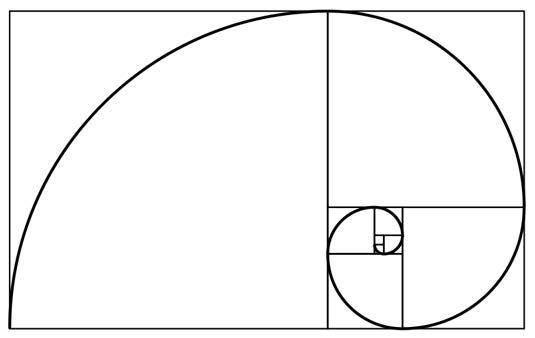

## Циклы
Note:
Сделать кахут "отгадай код по картинке".
Сделать так, чтобы было несколько правильных вариантов ответа

### Домашняя работа

Нарисовать блоки Фибоначчи.

### Задача №1. Золотая линия Фибоначчи

Note:
Можно в целом подробнее рассказать о том, что такое последовательность Фибоначчи,
где мы с ней можем встречаться в реальной жизни
https://medium.com/paradox-review/%D1%84%D0%B8%D0%B1%D0%BE%D0%BD%D0%B0%D1%87%D1%87%D0%B8-%D0%BF%D0%BE%D0%B2%D1%81%D1%8E%D0%B4%D1%83-d42dafe0a29e

### Задача №2

Note:
Порассуждать вместе с ребятами о том, как можно нарисовать эту фигуру
Как-то подтолкнуть ребят к тому, чтобы они догадались, что это всё
N черепах, которые выходят из одной точки под разными углами.
Показать как можно запустить N черепах паралелльно, а не по очереди.
Можно подумать как можно применить паралельное рисование к задаче про дом.
https://dev.to/taarimalta/how-to-draw-a-spiral-with-python-turtle-2n5c

