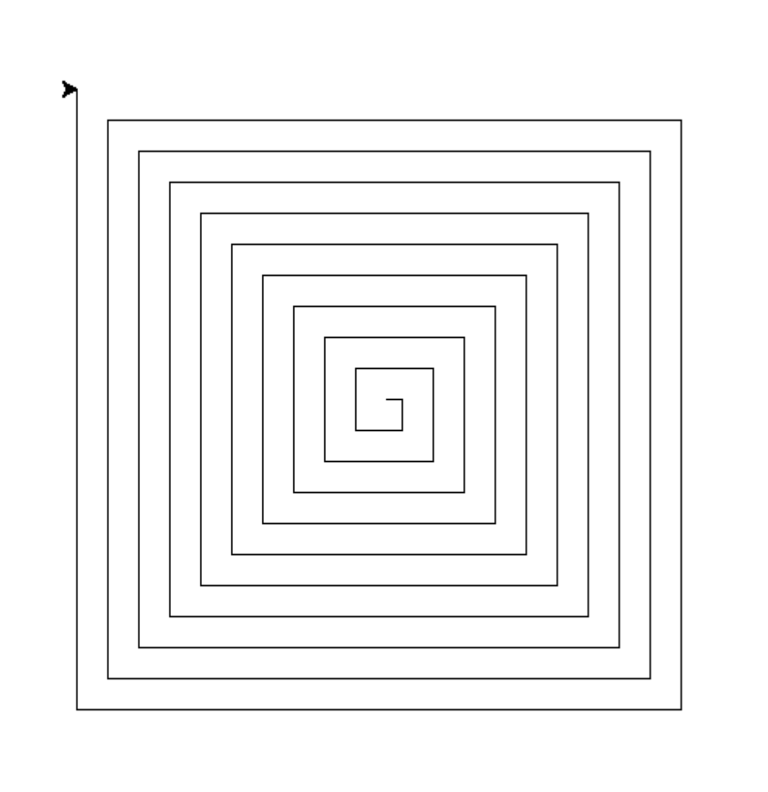
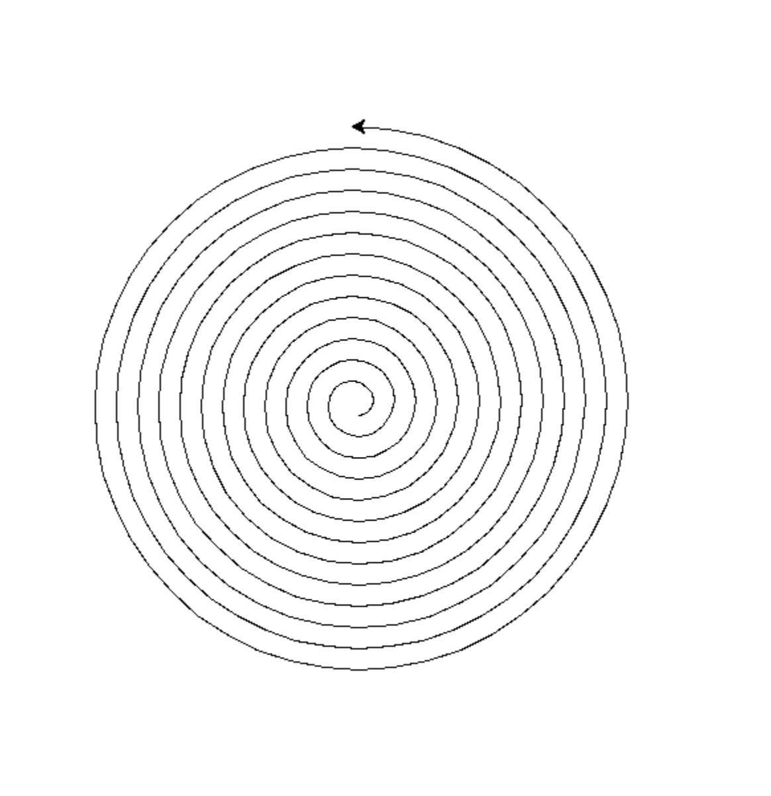
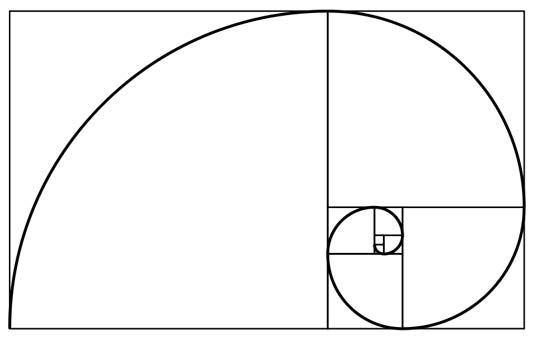

## Циклы


### Домашняя работа


Note: 10min


### Нарисовать квадрат

Как нарисовать квадрат?


```python
import turtle
t = turtle.Turtle()

# 🚀🚀🚀
t.speed('fast')

for i in range(4):
  t.forward(10)
  t.right(90)
```


### Задание №1



[проект в repl](https://replit.com/team/PythonClubByBeginner/19-fievralia-2022)
[демо](https://replit.com/@PythonClubByBeginner/19-fievralia-2022#main.py)


### Задание №2




### Золотое сечение. Числа Фибоначчи

0, 1, 1, 2, 3, 5, 8, 13, ...


### Задание №3

Написать код, который будет выводить в консоль N элемент последовательности Фибоначчи
Например,
1 - 0
2 - 1
3 - ??

[проект в repl](https://replit.com/team/PythonClubByBeginner/19-fievralia-20222)
[демо](https://replit.com/@PythonClubByBeginner/19-fievralia-20222#main.py)


### Задание №4

Нарисовать блоки Фибоначчи.


### Домашняя работа №1




### Домашняя работа №2


Note:
Начать с квадратной, потом перейти к круглой.
Золотое сечение
Спираль через точку
кахут на то, чтобы понять код по рисунку.


Note:
https://dev.to/taarimalta/how-to-draw-a-spiral-with-python-turtle-2n5c

