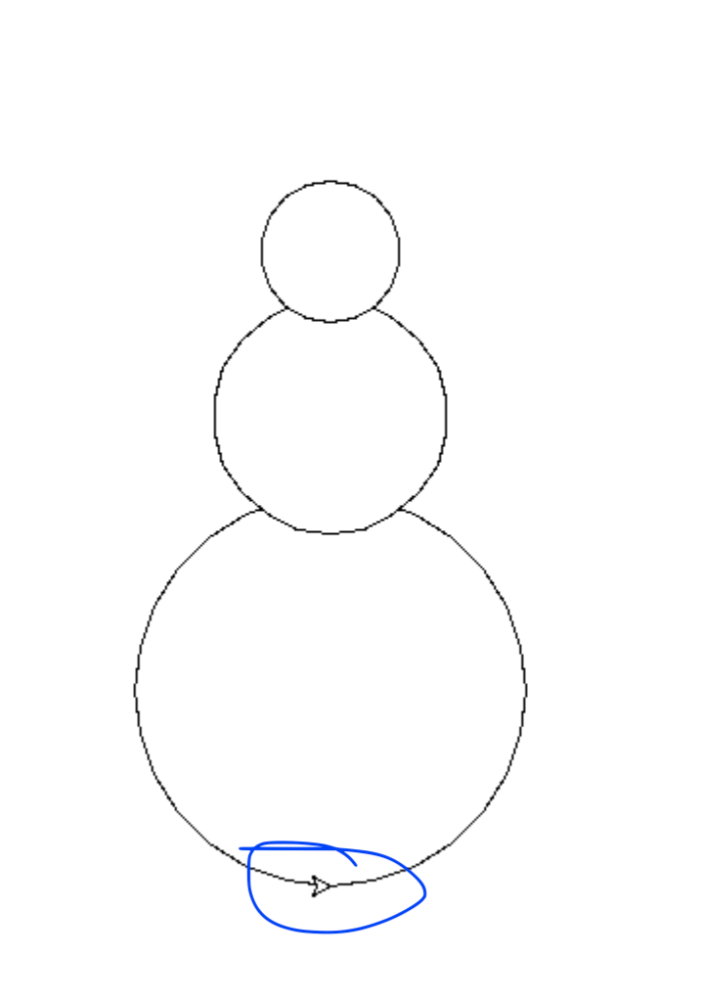
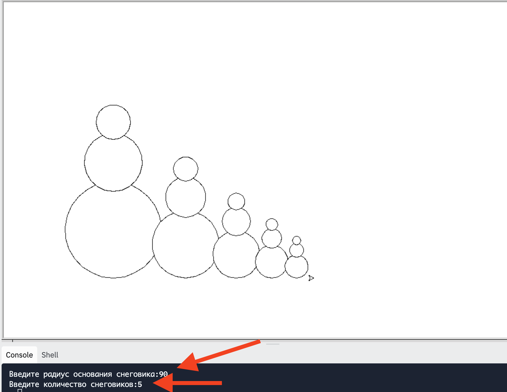
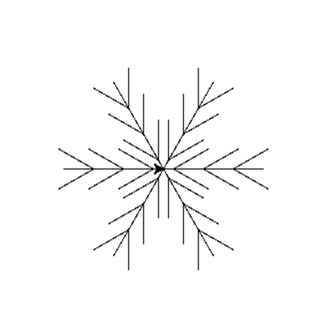

## Функции

### Что такое функция?

### Задача №1. Нарисовать снеговика

Нарисовать снеговика. Радиус основания снеговика указывается через командную строку

[Ссылка на проект](https://replit.com/team/PythonClubByBeginner/Snowman)

Note:
Разобрать функцию move
попробовать сразу t.circle. Потом посмотреть, что получается не очень.
Придти к тому, что надо поднять черепаху наверх на почти диаметр.

### Задача №2. Нарисовать N снеговиков

Нарисовать N снеговиков. Кол-во снеговиков указывается через командную строку

Note:
def snowman(base):
  up_total = 0
  for i in range(3):
    turtle.begin_fill()
    turtle.circle(base)
    up = 2 * base * 0.9
    up_total += up
    move(turtle, 'up', up)
    base = base * 0.6
    turtle.end_fill()
  move(turtle, 'down', up_total)

### Задача №3 Нарисовать снежинку как на картинке

### Домашняя работа

Совместить снеговика со снежинками. Нарисовать `N` снеговиков и идущий снег - нарисовать на "небе" `M` снежинок произвольного размера в произвольном порядке
N и M указываются через командную строку

Note:
Снежинка
https://projects.raspberrypi.org/en/projects/turtle-snowflakes/7
Звёздное небо

Задание 1, 2
def snowman(base):
  up_total = 0
  for i in range(3):
    turtle.begin_fill()
    turtle.circle(base)
    up = 2 * base * 0.9
    up_total += up
    move(turtle, 'up', up)
    base = base * 0.6
    turtle.end_fill()
  move(turtle, 'down', up_total)

for i in range(n):
  snowman(s)
  move(turtle, 'right', s * 1.5)
  s = s * 0.7

Задание 3
for i in range(6):
  angle = t1.heading()

  t1.forward(100)
  t1.right(180)

  for i in range(3):
    t1.forward(30)
    t1.left(150)
    t1.forward(40)
    t1.left(180)
    t1.forward(40)
    t1.setheading(angle)
    t1.left(30)
    t1.forward(40)
    t1.left(180)
    t1.forward(40)
    t1.setheading(angle + 180)

  t1.forward(10)
  t1.setheading(angle)
  t1.right(60)
