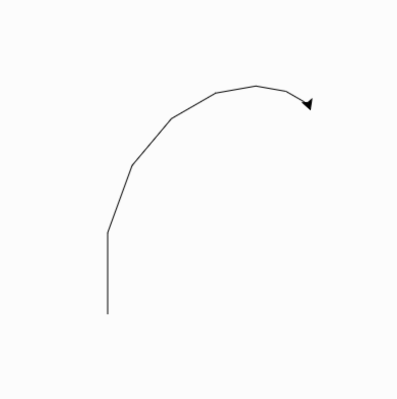

## Рекурсия

Что такое рекурсия?

[kahoot](https://create.kahoot.it/details/7a7eab37-7f9f-4549-8dfb-96893ba92fef)

### Цель

Note:
https://runestone.academy/ns/books/published//pythonds/Recursion/pythondsintro-VisualizingRecursion.html
https://stackoverflow.com/questions/46565729/turtle-graphics-with-recursion
https://cs111.wellesley.edu/~cs111/archive/cs111_spring15/public_html/notes/lectures/10_turtle_recursion_4up.pdf

