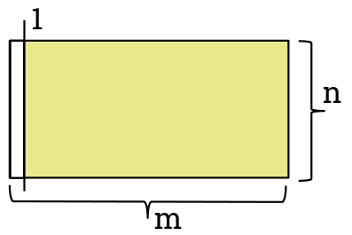
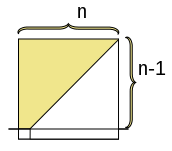
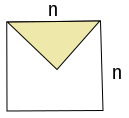
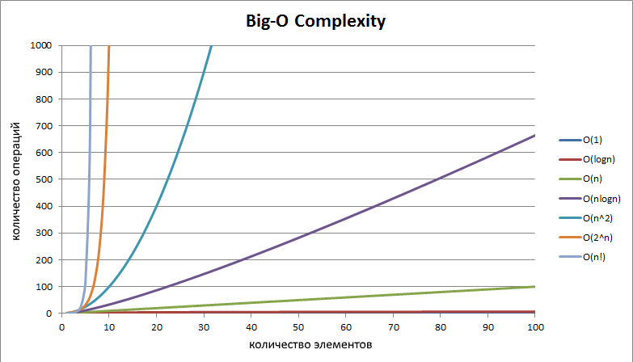

## Алгоритмическая сложность

Что такое вычислительная сложность алгоритма?


Вычислительная сложность пытается ответить на центральный вопрос разработки алгоритмов: как изменится время исполнения и объем занятой памяти в зависимости от размера входных данных?


# Примеры


Пример 1
```python
for i in range(n): # B
  for j in range(m): # A
    a[i][j] += 1; # С
```



Пример 2
```python
for i in range(n): # B
  for j in range(n-i): # A
    a[i][j] += 1; # С
```



Пример 2.2
```python
for i in range(n // 2): # B
  for j in range(i, n-i): # A
    a[i][j] += 1; # С
```



Пример 3
```python
for i in range(n): # B
  j = 1
  while j < n:
    a[i][j] += 1; # С
    j = j ** 2
```


Пример 4
```python
for i in range(100): # B
  for j in range(n): # A
    count += 1 # С
```


Сравнение сложностей алгоритмов



Note:
https:#pro-prof.com/archives/4275#page_1
https:#www.yuripetrov.ru/edu/python/ch_06_01.html#id3

