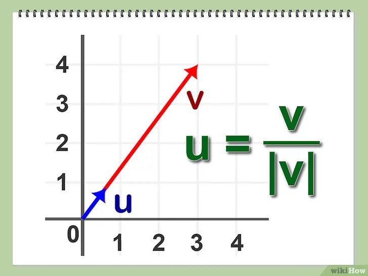

## Управление в pygame

 - клавиатура
 - мышь
 - touch screen


### События

```python
    # Process input (events)
    for event in pygame.event.get():
        # check for closing window
        if event.type == pygame.QUIT:
            running = False
        print(event)
```


### Подготовка


### Игрок

```python
class Player(pygame.sprite.Sprite):
    def __init__(self):
        pygame.sprite.Sprite.__init__(self)
        self.image = pygame.Surface((50, 40))
        self.image.fill(GREEN)
        self.rect = self.image.get_rect()
        self.rect.centerx = WIDTH / 2
        self.rect.bottom = HEIGHT - 10
        self.speedx = 0
```


### Добавление в group

```python
all_sprites = pygame.sprite.Group()
player = Player()
all_sprites.add(player)
```


### Клавиатура


### Вариант 1

```python
    for event in pygame.event.get():
        if event.type == pygame.KEYDOWN:
            if event.key == pygame.K_LEFT:
                player.speedx = -8
            if event.key == pygame.K_RIGHT:
                player.speedx = 8
```


### Вариант 2

```python
      def update(self):
        self.speedx = 0
        keystate = pygame.key.get_pressed()
        if keystate[pygame.K_LEFT]:
            self.speedx = -8
        if keystate[pygame.K_RIGHT]:
            self.speedx = 8
        self.rect.x += self.speedx
```


### Мышь


### Вариант 1

```python
    # Process input (events)
    for event in pygame.event.get():
        # check for closing window
        if event.type == pygame.QUIT:
            running = False
        if event.type == pygame.MOUSEBUTTONDOWN and event.button == 1:
            player.rect.center = event.pos
```

### Вариант 2

```python
    def update(self):
        mouse_state = pygame.mouse
        if (mouse_state.get_pressed()[0] == True):
            self.rect.center = mouse_state.get_pos()
```


### Вектор. Нормализация

[Статья](https://ru.wikihow.com/%D0%BD%D0%BE%D1%80%D0%BC%D0%B8%D1%80%D0%BE%D0%B2%D0%B0%D1%82%D1%8C-%D0%B2%D0%B5%D0%BA%D1%82%D0%BE%D1%80)




### Двигаемся за мышкой

```python
    def update(self):
        mouse_state = pygame.mouse
        if (mouse_state.get_pressed()[0] == True):
            start_point = self.rect.center
            dest_point = mouse_state.get_pos()

            vector = (
                dest_point[0] - start_point[0],
                dest_point[1] - start_point[1]
            )

            length = math.sqrt(vector[0]**2 + vector[1]**2)

            self.rect.center = (
                self.rect.center[0] + vector[0] / length * 5,
                self.rect.center[1] + vector[1] / length * 5,
            )
```
